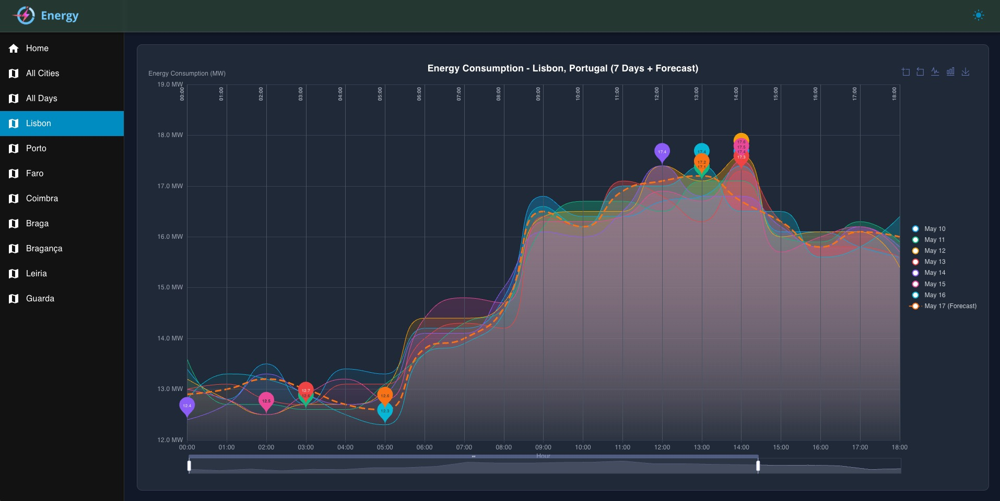

# Energy Forecast Simulator

A comprehensive web application for simulating and forecasting energy consumption patterns across Portuguese cities using data science and interactive visualizations.



## 🎯 Overview

This project simulates realistic energy consumption data for 8 major Portuguese cities and uses machine learning techniques to predict future consumption patterns. The application provides interactive visualizations to analyze consumption trends and compare patterns across different cities and time periods.

## 🏙️ Cities Covered

- **Lisbon** - Capital and largest city
- **Porto** - Second largest city
- **Faro** - Southern coastal city
- **Coimbra** - Historic university city
- **Braga** - Northern cultural hub
- **Bragança** - Northeastern city
- **Leiria** - Central region
- **Guarda** - Highest city in Portugal

## ✨ Features

### Data Generation
- **Realistic Consumption Patterns**: Simulates hourly energy consumption (MW) with realistic daily patterns
- **City-Specific Profiles**: Each city has unique base consumption levels based on population
- **Time-Based Variations**: 
  - Lower consumption at night (00:00-06:00)
  - Peak consumption during business hours (09:00-15:00)
  - Gradual decline in the evening
- **Random Variations**: Adds realistic fluctuations to simulate real-world conditions

### Forecasting Engine
- **Pandas-Based Predictions**: Uses historical data to forecast next-day consumption
- **Hybrid Algorithm**: Combines weighted averages (70%) and trend analysis (30%)
- **Weighted Recent Data**: More recent days have higher influence on predictions
- **Trend Detection**: Linear regression identifies increasing/decreasing patterns
- **Bounded Predictions**: Ensures forecasts stay within realistic ranges

### Interactive Visualizations

#### 1. Consumption Page (All Cities Comparison)
- Select any day to view all 8 cities simultaneously
- Compare consumption patterns across different regions
- Interactive legend to toggle city visibility
- Hourly breakdown (00:00-23:00)

#### 2. Lisbon Page (Multi-Day Analysis)
- View 7 days of historical data + 1 day forecast
- Forecast displayed with distinctive dashed line
- Each day shown as a separate colored series
- Min/Max consumption markers
- Toggle forecast visibility from legend

#### 3. AllDays Page
- Comprehensive view of all data
- Filter and compare different time periods

## 🛠️ Technology Stack

### Backend
- **Python 3.x**
- **Pandas**: Data manipulation and analysis
- **NumPy**: Numerical computations
- **JSON**: Data storage format

### Frontend
- **Next.js**: React framework
- **React**: UI components
- **ECharts**: Interactive data visualization
- **Context API**: State management

## 📊 Data Structure

### Historical Data Format
```json
{
  "Lisbon": {
    "2026-05-10": {
      "00:00": "12.9",
      "01:00": "13.0",
      ...
      "23:00": "13.3"
    }
  }
}
```

### Prediction Format
```json
{
  "Lisbon": {
    "2026-05-17": {
      "00:00": "12.9",
      "01:00": "13.0",
      ...
      "23:00": "13.6"
    }
  }
}
```

## 🚀 Getting Started

### Prerequisites
```bash
# Python 3.x
# Node.js and npm
```

### Backend Setup
```bash
cd backend

# Install dependencies
pip3 install pandas numpy

# Generate consumption data and predictions
python3 main.py
```

This will:
1. Generate 7 days of historical data (May 10-16, 2026)
2. Save data to `frontend/src/app/data/consumption/`
3. Generate next-day predictions for all cities
4. Save predictions to `frontend/src/app/data/forecast/pandas/`

### Frontend Setup
```bash
cd frontend

# Install dependencies
npm install

# Run development server
npm run dev
```

Access the application at `http://localhost:3000`

## 📁 Project Structure

```
energy-forecast/
├── backend/
│   ├── main.py                 # Main data generation script
│   └── requirements.txt        # Python dependencies
├── frontend/
│   └── src/
│       └── app/
│           ├── components/     # Reusable UI components
│           ├── context/        # Global state management
│           ├── data/
│           │   ├── consumption/    # Historical data
│           │   └── forecast/
│           │       └── pandas/     # Prediction data
│           └── pages/
│               ├── Consumption/    # All cities comparison
│               ├── Lisbon/         # Lisbon detailed view
│               └── AllDays/        # Multi-day analysis
└── README.md
```

## 🔮 Prediction Algorithm

The forecasting system uses a sophisticated hybrid approach:

1. **Weighted Moving Average**: Recent days weighted higher (1, 2, 3, ..., 7)
2. **Trend Analysis**: Linear regression detects patterns
3. **Combination**: 70% weighted average + 30% trend prediction
4. **Bounds Checking**: Predictions stay within ±10% of historical range
5. **Realistic Variation**: Small random fluctuations added

## 📈 Features Roadmap

Potential future enhancements:
- [ ] ARIMA/SARIMA time series forecasting
- [ ] Prophet integration for seasonal patterns
- [ ] XGBoost for feature-based predictions
- [ ] LSTM neural networks for complex patterns
- [ ] Weather data integration
- [ ] Real-time data updates
- [ ] Export reports (PDF/CSV)
- [ ] Historical comparison tools
- [ ] Anomaly detection

## 📝 Usage Examples

### Generate New Data
```bash
cd backend
python3 main.py
```

### View Specific City
Navigate to `/Lisbon` page to see detailed Lisbon analysis with forecast.

### Compare All Cities
Navigate to `/Consumption` page and select a day to compare all cities.

### Toggle Forecast
Click on "May 17 (Forecast)" in the legend to show/hide predicted data.

## 🎨 Visualization Features

- **Interactive Charts**: Zoom, pan, and filter data
- **Responsive Design**: Works on desktop and mobile
- **Dark Mode Support**: Toggle between light and dark themes
- **Export Options**: Save charts as images
- **Multiple Chart Types**: Switch between line and bar charts
- **Data Zoom**: Focus on specific time ranges

## 📊 Energy Consumption Patterns

Typical daily patterns:
- **Night (00:00-06:00)**: ~11-13 MW (low consumption)
- **Morning (06:00-09:00)**: Rising to ~14 MW
- **Peak (09:00-15:00)**: ~15-17 MW (business hours)
- **Evening (15:00-22:00)**: Gradually declining to ~14 MW
- **Late Night (22:00-23:00)**: Drop to ~12-13 MW

## 🤝 Contributing

Contributions are welcome! Areas for improvement:
- Additional forecasting algorithms
- More sophisticated ML models
- Integration with real energy data APIs
- Enhanced visualizations
- Performance optimizations

## 📄 License

This is an educational project for demonstrating energy consumption forecasting techniques.

## 👤 Author

Energy consumption simulation and forecasting system built with Python and Next.js.

## 🙏 Acknowledgments

- ECharts for powerful visualization capabilities
- Pandas for data manipulation excellence
- Next.js for the robust React framework
